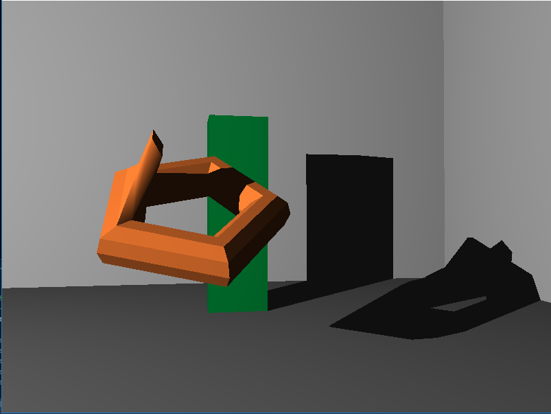
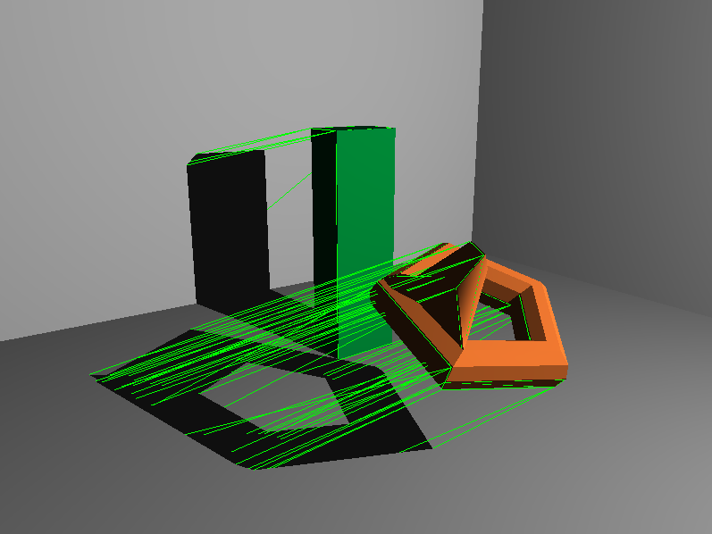

# TSBK03-Shadow-volumes

OpenGL implementation of stencil shadow volumes using the geometry shader. Project in the course TSBK03 - Advanced Game Programming.
Shadow volumes is a robust method for dynamic, real-time, shadows that supports point light sources and self-shadowing nicely. 

The scene is rendered in three passes:
- An ambient pass, that results in ambient lightning in shadowed fragments and updates the z-buffer.
- A volume creation pass, in which the shadow volumes are created and rendered to the stencil buffer.
- A final pass, in which the scene is rendered with lightning, using the stencil buffer as a mask. 

The shadow volume creation is done using the geometry shader (see shaders/shadowVolume.geom) and triangles with adjacency information. A better way to do this would be to use a half-edge mesh represenation of the geometry, which enables a more efficient way to identify the adjacent indices. This is, however, beyond the scope of this project, but might be implemented in the future to add the possiblity of including more complex objects (with a lot of triangles) in the scene. 

Below is some result images of the project at 2019-01-23. What is not visible in these is that the shadows are dynamic. The orage object is rotating and the light source can be moved using the arrow keys. I will make a video showing the result in a better way when I have time over. 

**Some result images:**

  

 

Notice how the occluders cast shadows on other objects in the scene, but also on themselves (second image, with torus-like object). This is one of the strengths of this method, compared to shadow mapping (which is more commonly used).

  

 
The image above shows the final result, including the shadow volume in wireframe. Notice how the self-shadow on the torus occurs due to intersection of the shadow volume with the object itself. 
